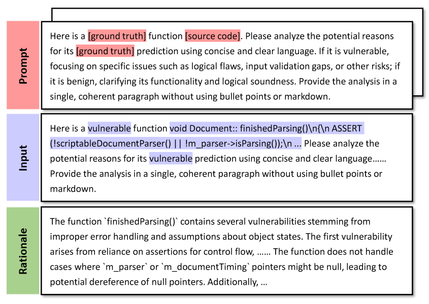

# DExVul

## Environment Setup
- Setup Python environment:
```
python 3.10.15
```

- Setup Python Package:
```
pip install -r requirements.txt
```

## Command Usages
#### Args usages
- `--from_pretrained`: `Salesforce/codet5-small`, `Salesforce/codet5-base`
- `--dataset`: `ctf`, `magma`, `MegaVul`, `Big-Vul`, `Devign`, `Reveal`
- `--small_sample`: `_25`, `_50`, `_75`
- `--alpha`: Task weight for multi-task training. Loss = alpha * label_prediction_loss + (1 - alpha) * rationale_generation_loss
  - `--alpha 0.5`: recommended
- `--batch_size`: Batch size
- `--max_input_length`: Maximum input length
- `--lr`: Learning rate. Default is 5e-6.
- `--epochs`: Maximum epoch for training. Default is 20.
- `--model_type`:
  - `standard`: Standard finetuning
  - `task_prefix`: DExVul


#### Example usages
- Standard finetuning with `Full datasets`:
```python
python run.py --from_pretrained Salesforce/codet5-base --dataset MegaVul --model_type standard --batch_size 16
```


- DExVul with `Full datasets` and `ChatGPT rationale`:
```python
python run.py --from_pretrained Salesforce/codet5-base --dataset MegaVul --model_type task_prefix --alpha 0.5 --batch_size 16
```
If you want to run small sample training, please add `--small_sample _x` to the command. (`x` represents the number of samples, selecting from 25, 50, 75)

## Prompt for Explanation
#### Dataset generation
```
Here is a [ground truth] function [source code]. Please analyze the potential reasons for its [ground truth] prediction using concise and clear language. If it is vulnerable, focusing on specific issues such as logical flaws, input validation gaps, or other risks; if it is benign, clarifying its functionality and logical soundness. Provide the analysis in a single, coherent paragraph without using bullet points or markdown.
```
The following figure that appears in the paper shows more detailed information

#### Classification
```
Please determine whether there are vulnerabilities in the source code of the function below.If vulnerabilities exist, please indicate their locations and the reasons for their occurrence; if there are no vulnerabilities, please explain the function's functionality. Please strictly follow the template below: if there is a vulnerability, output: VULNERABLE-YES. Include the location and reason for the vulnerability; if there are no vulnerabilities, output: VULNERABLE-NO. Include an explanation of the function's functionality. Please adhere strictly to the template. Please use as concise language as possible. Do not use bullet points or markdown format. Provide the description in a single paragraph.
```
